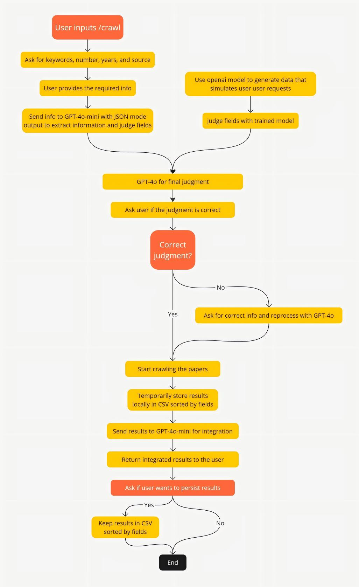

# Telegram Academic Bot

## 项目简介

Telegram Academic Bot 是一个基于自然语言处理、信息检索和文档管理的智能 Telegram 机器人。它帮助用户高效地获取学术资源、推荐相关论文、实时获取新闻信息，并实现基于文档的智能问答。该项目综合了爬虫技术、Pinecone 向量数据库、GPT 语言模型及自定义文本分类模型，提供了一站式的学术信息服务。

## 项目功能

### 1. `/crawl`
用户可以通过此命令从 **CNKI** 或 **Google Scholar** 爬取符合条件的学术论文。整个过程经过多个步骤处理：
- 用户首先输入关键字、研究领域、论文数量、发布时间及目标来源（CNKI 或 Google Scholar）等信息；
- 然后，系统通过 GPT-4o-mini、自定义文本分类模型和 GPT-4o 综合处理这些请求，使用 OpenAI 的 JSON mode 对用户请求进行智能分析和分类；
- 爬取到的论文信息会根据用户的要求被整理并返回，同时支持本地文件存储和数据持久化。

为更好理解整个 `/crawl` 过程，下面的流程图展示了每个步骤的详细信息：



### 2. `/recommend`
基于本地存储的论文数据，用户可以通过该命令获得符合其需求的论文推荐。该功能会根据用户输入的关键词或研究领域，从本地的 CSV 文件中筛选出最合适的论文摘要及相关信息，并将论文标题和链接返回给用户。

### 3. `/news`
通过集成 **Perplexity API** 实时获取最新的新闻资讯。用户可以根据自己的兴趣自定义新闻主题或关键词，Bot 会返回相关领域的最新动态，帮助用户获取及时的学术或社会新闻。

### 4. `/upload`
用户可以通过此命令将 PDF 文档上传至 Pinecone 向量数据库。该数据库用于存储和索引用户的学术文档，结合自然语言处理技术，能够为用户提供高效的文档检索和推荐服务。

### 5. `/rag`
结合 **RAG** (Retrieval-Augmented Generation) 技术，用户可以通过此命令与上传至 Pinecone 的文档进行互动。用户提出问题后，系统会在数据库中检索最相关的文档内容，将其与用户提问结合，生成完整的回答，帮助用户快速获取所需信息。

## 项目技术架构

- **自然语言处理**: 使用 GPT-4o-mini 和 GPT-4o 语言模型处理用户请求，进行智能问答和信息抽取。
- **自定义文本分类模型**: 项目实现了多种文本分类模型，包括 **TextCNN**、**TextRNN** 和 **TextRCNN**。这些模型的训练数据通过 OpenAI 模型结合特定的 prompt 模拟生成，确保数据覆盖面广且符合用户需求。
- **爬虫技术**: 实现了对 CNKI 和 Google Scholar 平台的论文爬取功能，满足用户的个性化需求。
- **Pinecone API**: 提供高效的向量化数据库服务，用于文档的存储、检索和管理。
- **Perplexity API**: 实现新闻信息的实时获取，帮助用户随时掌握最新动态。

## 配置 API 密钥

在使用本项目之前，请配置以下 API 密钥：
- **OpenAI API 密钥**: 负责处理自然语言请求和生成内容。
- **Telegram BOT_TOKEN**: 用于 Telegram 机器人与用户的交互。
- **Pinecone API 密钥**: 用于管理和操作 Pinecone 向量数据库。
- **Perplexity API 密钥**: 用于实时获取最新的新闻信息。

## 文件说明

- **func_crawl.py**: 实现 `/crawl` 功能，负责从 CNKI 或 Google Scholar 爬取符合条件的学术论文，并将整理后的结果返回给用户。
  
- **func_recommend.py**: 实现 `/recommend` 功能，依据本地存储的论文数据推荐符合用户需求的论文，并返回摘要和链接。

- **func_news.py**: 实现 `/news` 功能，集成 Perplexity API 实时查询并返回与用户指定主题相关的最新新闻。

- **func_upload.py**: 实现 `/upload` 功能，将用户上传的 PDF 文档存储到 Pinecone 向量数据库中，以便后续检索和管理。

- **func_rag.py**: 实现 `/rag` 功能，通过 Retrieval-Augmented Generation (RAG) 技术，实现与 Pinecone 数据库中的文档进行交互式问答。

- **main.ipynb**: 汇总了所有功能，用户只需运行此文件即可体验 Telegram Academic Bot 提供的完整功能。

- **DataGeneration.py**: 使用 OpenAI 模型结合特定 prompt 生成模拟的用户请求数据，主要用于训练和测试文本分类模型。

- **TextCategorization.py**: 实现文本分类模型的训练与评估，项目中使用了多种模型（如 TextCNN、TextRNN、TextRCNN）来提升分类效果。

- **visualization.py**: 提供可视化工具，用于监控和展示模型训练过程中的各类指标（如损失和准确率），支持任意模型的训练可视化。

<!-- ## 安装与使用

1. 克隆项目:
   ```bash
   git clone https://github.com/your-repo/telegram-academic-bot.git
   ```
2. 安装依赖:
   ```bash
   pip install -r requirements.txt
   ```
3. 配置 API 密钥:
   在 `.env` 文件中添加 OpenAI、Pinecone、Perplexity 等 API 的密钥。

4. 启动项目:
   ```bash
   python bot.py
   ``` -->

## 未来改进方向

- 添加更多数据源支持，如 **arXiv** 和 **PubMed**，丰富论文获取渠道；
- 进一步优化文本分类模型，提高推荐与检索的精确性；
- 增加对图像、表格等非文本类学术资源的解析与存储功能；
- 实现多语言支持，方便全球学术用户使用。

## 贡献

欢迎大家提交 Issue 和 Pull Request，帮助我优化项目！
