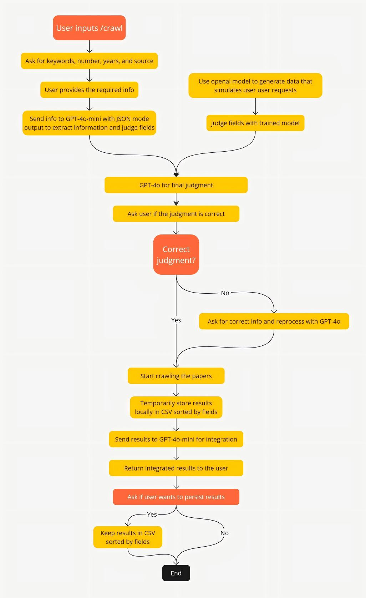

# Telegram Academic Bot

## Project Overview

Telegram Academic Bot is an intelligent bot based on natural language processing, information retrieval, and document management, designed to help users efficiently access academic resources, recommend relevant papers, obtain real-time news, and provide document-based Q&A. The project integrates web scraping, Pinecone vector database, GPT language models, and custom text classification models to offer a one-stop academic information service.

## Features

### 1. `/crawl`
Users can use this command to scrape academic papers from **CNKI** or **Google Scholar** based on specified criteria. The process involves several steps:
- Users input keywords, research fields, number of papers, publication date, and the target source (CNKI or Google Scholar);
- The system processes these requests through GPT-4o-mini, custom text classification models, and GPT-4o, using OpenAI's JSON mode for smart analysis and classification;
- Scraped paper information is returned to the user, organized as requested, with options for local file storage and data persistence.

The following flowchart illustrates each step of the `/crawl` process:



### 2. `/recommend`
Based on locally stored paper data, users can get paper recommendations that match their needs. This feature filters the most relevant abstracts and information from local CSV files based on keywords or research fields and returns the paper titles and links.

### 3. `/news`
This command integrates the **Perplexity API** to fetch real-time news updates. Users can customize news topics or keywords of interest, and the bot will return the latest information, helping them stay updated with academic or societal trends.

### 4. `/upload`
Users can upload PDF documents to the Pinecone vector database through this command. The database is used for storing and indexing academic documents, enabling efficient document retrieval and recommendation using natural language processing.

### 5. `/rag`
Leveraging **RAG** (Retrieval-Augmented Generation) technology, this command allows users to interact with documents uploaded to Pinecone. After asking a question, the system retrieves the most relevant content from the database and combines it with the user's query to generate a complete response, helping users quickly obtain the needed information.

## Technical Architecture

- **Natural Language Processing**: GPT-4o-mini and GPT-4o language models handle user requests, enabling intelligent Q&A and information extraction.
- **Custom Text Classification Models**: The project implements multiple text classification models, including **TextCNN**, **TextRNN**, and **TextRCNN**. Training data is generated using OpenAI models with specific prompts to ensure wide coverage and user relevance.
- **Web Scraping**: Implements scraping from CNKI and Google Scholar, tailored to user preferences.
- **Pinecone API**: Provides efficient vectorized database services for document storage, retrieval, and management.
- **Perplexity API**: Used for real-time news updates, helping users stay informed.

## API Key Configuration

Before using this project, configure the following API keys:
- **OpenAI API Key**: Handles natural language requests and content generation.
- **Telegram BOT_TOKEN**: Facilitates interaction between the Telegram bot and users.
- **Pinecone API Key**: Manages and operates the Pinecone vector database.
- **Perplexity API Key**: Fetches real-time news updates.

## File Structure

- **func_crawl.ipynb**: Implements the `/crawl` feature for scraping academic papers from CNKI or Google Scholar and returning organized results to the user.
  
- **func_recommend.ipynb**: Implements the `/recommend` feature, recommending papers based on locally stored data and returning abstracts and links.

- **func_news.ipynb**: Implements the `/news` feature, integrating the Perplexity API to query and return the latest news related to user-specified topics.

- **func_upload.ipynb**: Implements the `/upload` feature, storing user-uploaded PDFs into the Pinecone vector database for future retrieval and management.

- **func_rag.ipynb**: Implements the `/rag` feature, utilizing Retrieval-Augmented Generation (RAG) to enable interactive Q&A with documents in the Pinecone database.

- **main.ipynb**: Consolidates all functionalities. Users can run this file to experience the complete features of the Telegram Academic Bot.

- **DataGeneration.ipynb**: Uses OpenAI models with specific prompts to generate simulated user request data, primarily for training and testing text classification models.

- **TextCategorization.ipynb**: Implements training and evaluation of text classification models. The project uses various models (e.g., TextCNN, TextRNN, TextRCNN) to improve classification accuracy.

- **visualization.py**: Provides visualization tools for monitoring and displaying various metrics (e.g., loss and accuracy) during model training, supporting visualization for any model training process.

<!-- ## Installation and Usage

1. Clone the project:
   ```bash
   git clone https://github.com/your-repo/telegram-academic-bot.git
   ```
2. Install dependencies:
   ```bash
   pip install -r requirements.txt
   ```
3. Configure API keys:
   Add OpenAI, Pinecone, Perplexity, and other API keys in the `.env` file.

4. Start the project:
   ```bash
   python bot.py
   ``` -->

## Future Improvements

- Add support for more data sources like **arXiv** and **PubMed** to expand paper retrieval options.
- Further optimize text classification models to enhance recommendation and retrieval accuracy.
- Add support for parsing and storing non-text academic resources such as images and tables.
- Implement multi-language support to make the bot accessible to global academic users.

## Contributions

Feel free to submit issues and pull requests to help improve the project!